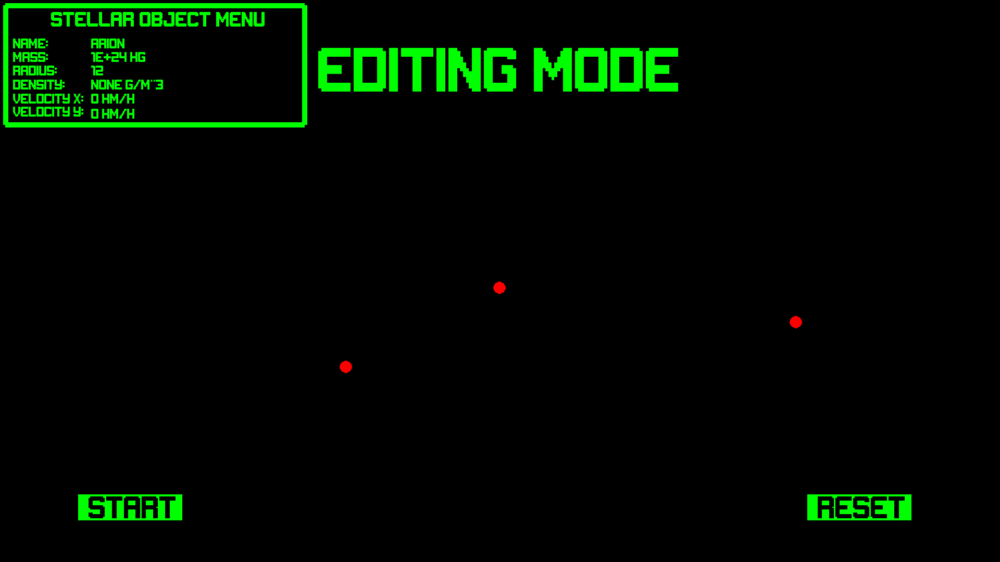
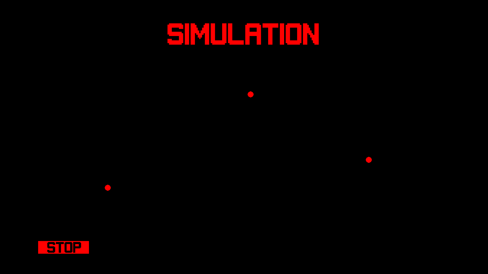
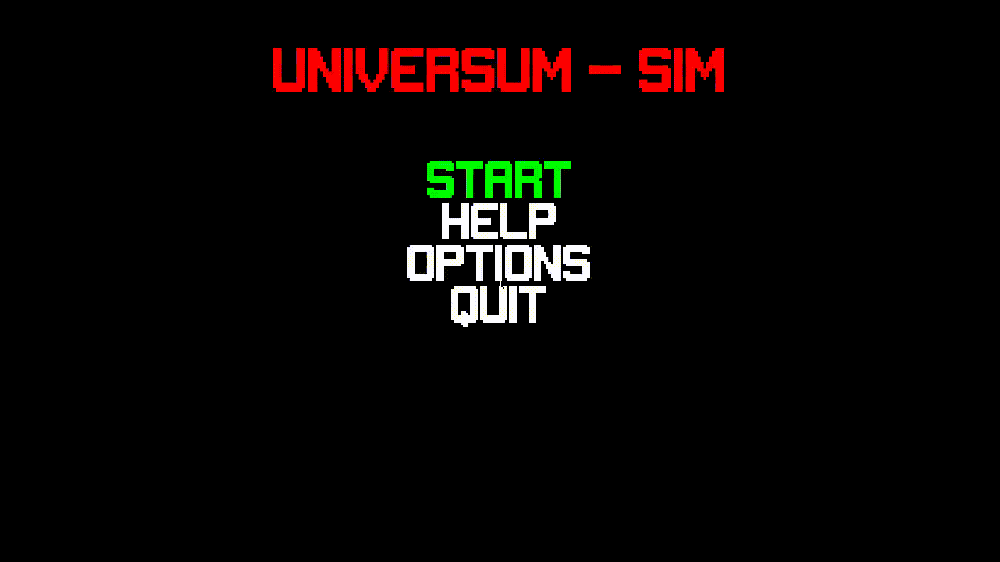

[](https://opensource.org/licenses/MIT)
# Universum-Sim
>This is the final course project of an advanced Python class.
>It is an extremly simplified simulation of planetary bodies' movement

## Project Status
Project is: _no longer being worked on_ 

## Table of contents
* [Setup](#Setup)
* [Features](#Features)
* [Screenshots](#Screenshots)
* [GIF](#GIF)
* [Contact](#Contact)

## Setup
To run this project install numpy and pygame: (For Ubuntu)
```
$ sudo apt-get install python3-numpy
$ sudo apt-get install python3-pygame
```

## Features:
* Place planetary bodies in main menu via left mouse click, remove with right mouse
* See the attributes of the planetary bodies by left clicking on them
* Press start to simulate their movement (Maximum of 10 bodies, works best around 3)
* Navigate the menu with the arrow keys and esc

## Screenshots
Start menu:

Pre-Simulation screen with planet data:

During Simulation:


## GIF


## Contact
Created by Marten B. Scheuck - feel free to contact me

<!-- Optional -->
<!-- ## License -->
<!-- This project is open source and available under the MIT license (https://opensource.org/licenses/MIT). -->
